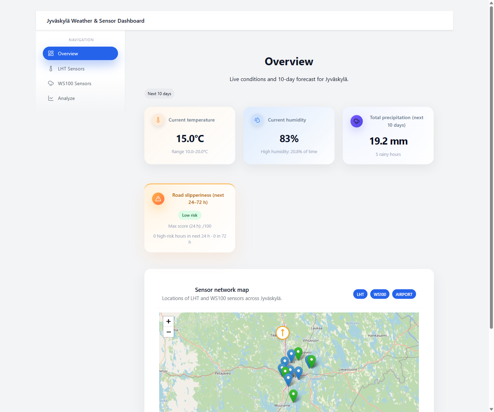
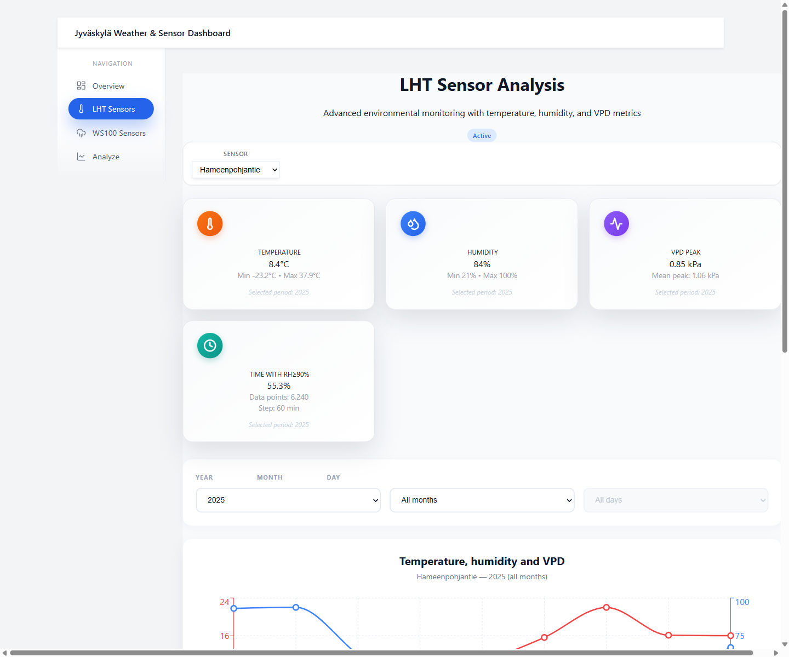
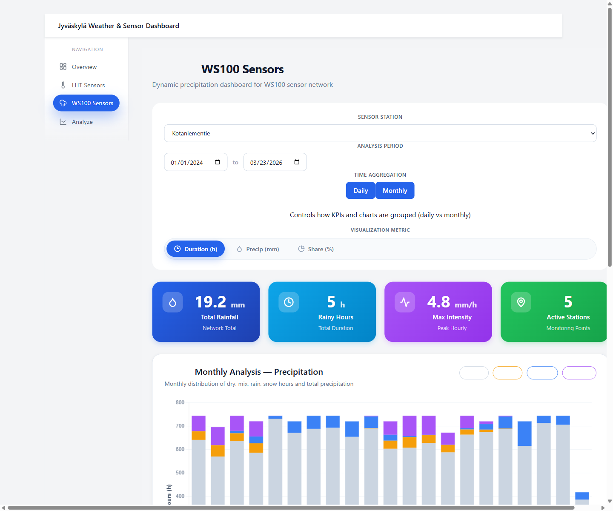
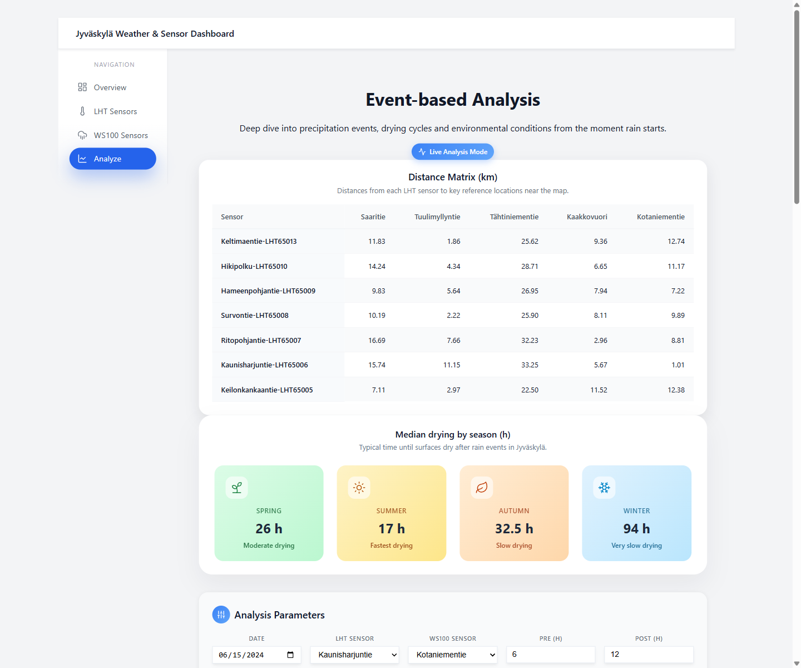

# Jyväskylä Weather & Sensor Dashboard

A local weather dashboard I built to explore how precipitation events, humidity, and wind conditions affect road surfaces in Jyväskylä, Finland.

The app connects two city sensor networks (LHT temperature/humidity sensors and WS100 precipitation gauges) with Open-Meteo forecast data, and lets me inspect individual rain events, drying behaviour, and environmental patterns through an interactive UI.

---

## Why I built this

I live in Jyväskylä and wanted to answer a deceptively simple question: after it rains, how long does it actually take for roads to dry — and what conditions make that faster or slower?

The city already publishes sensor data from two networks (LHT and WS100), but none of it is easy to explore together. So I cleaned the datasets, paired sensors by proximity, and built a dashboard that shows what happens before, during, and after individual precipitation events.

This started as a data cleaning exercise and grew into a full-stack project. It is not a production system — it is a portfolio piece that reflects how I approach messy real-world data.

---

## What the app does

The dashboard has four main pages:

### Overview



The landing page. Shows current weather conditions, a short forecast snapshot, and an interactive Leaflet map with all sensor locations plotted. Each sensor type (LHT, WS100, Airport) can be toggled independently. This page gives a quick orientation before diving into the detail pages.

### LHT Sensors



Focused on the LHT sensor network: temperature, relative humidity, and VPD (vapour pressure deficit) for a selected station. Includes time-series charts with a date range filter, monthly summary cards, and a network-wide comparison matrix so you can see how one location differs from the rest. The 7 LHT stations are spread across different parts of the city — residential streets, hillsides, sheltered areas — so the differences are real and visible.

### WS100 Sensors



Focused on the WS100 precipitation network: rain totals, precipitation duration, and per-station summaries. Includes monthly bar charts, a station selector, and a deviation matrix that highlights which stations consistently run above or below the network mean. The 5 WS100 gauges cover enough of the city to show meaningful spatial variation.

### Analyze



The deepest page. This is where the event-based analysis lives. You pick a date, an LHT sensor, a WS100 sensor, and a time window (hours before and after the event start). The backend detects precipitation events from the WS100 data, then pairs them with humidity and wind conditions from the LHT and Open-Meteo datasets.

The page shows:
- **Event summary cards** — total rainfall, duration, intensity class, precipitation type
- **Wet/dry fraction chart** — how road surface wetness evolves hour by hour relative to the event
- **Environment means chart** — humidity, dew-point spread, wind, pressure around the event window
- **RH heatmap** — relative humidity by hour-of-day for the event date(s)
- **Distance matrix** — physical distances between all sensors, used to validate pairing choices
- **Season drying strip** — median drying times broken out by season

The Analyze page auto-loads with sensible defaults on first visit (Kaunisharjuntie + Kotaniementie, 2024-09-17), so you see real data immediately without needing to configure anything.

---

## One real event: July 28, 2023

To show what the app actually produces, here is a real example.

On July 28, 2023, Jyväskylä experienced a significant multi-day rain event. When I run that date through the Analyze page (Keilonkankaatie + Tuulimyllyntie, 72 h post-event window), the app detects one extreme-intensity event:

- **101 mm total precipitation**
- **42 hours duration**
- **100 % wet fraction** for the entire 72-hour post-event window — roads never dried
- **Wind gusts up to 52 km/h**, pressure dropping to ~975 hPa

Yle reported on flooding in the Jyväskylä region around the same time. The rainfall totals my app calculated are in the same range as what was reported. That alignment gave me confidence that the event detection and aggregation logic is working correctly — but I want to be clear: this is not a validated meteorological tool. It is a student project that happens to produce plausible numbers for a known weather event.

---

## Tech stack
    
| Layer | Tools |
|-------|-------|
| Backend | Python, FastAPI, pandas, NumPy |
| Frontend | React 19, Vite, Chart.js, Recharts, Leaflet, react-router-dom |
| Data | Open-Meteo API (historical + forecast), city LHT and WS100 CSV exports |
| UI details | lucide-react icons, chartjs-plugin-zoom, chartjs-plugin-annotation, framer-motion |

---

## How to run locally

**Requirements:** Python 3.12+, Node.js 18+

### Backend

```bash
cd backend
pip install -r requirements.txt
cd ..
python -m uvicorn backend.app:app --reload --host 127.0.0.1 --port 8000
```

### Frontend

```bash
cd frontend
npm install
npm run dev
```

The frontend dev server proxies `/api` requests to the backend automatically.

| | URL |
|---|---|
| Frontend | `http://localhost:5173` |
| Backend API | `http://localhost:8000` |
| API docs (Swagger) | `http://localhost:8000/docs` |

---

## Project structure

```
backend/
  app.py                  FastAPI entry point and route registration
  config.py               Data directory paths
  core/                   Event detection, physics calculations, data I/O
  services/               Business logic (pair analysis, sensor metadata, etc.)
  routes/                 Route modules (road forecast)

frontend/
  src/
    pages/                Page components (Overview, LHT, WS100, Analyze, RoadForecast)
    components/           Shared UI: charts, map, cards, layout
    styles/               Additional CSS modules

cleaned_datasets/         Processed CSV files the app reads at runtime
  LHT/                   7 station files (temperature, humidity)
  wes100/                5 station files (precipitation)

Marjetas_Data/            Raw source data and reference material
Data/                     Local analysis outputs (not used by the app)
Data- analytics/          Jupyter notebooks for exploratory work
docs/screenshots/         Screenshots used in this README
```

---

## Data sources

- **LHT sensors** — 7 temperature/humidity stations operated by the city of Jyväskylä. Data exported as CSV and cleaned in notebooks before use.
- **WS100 sensors** — 5 precipitation gauges (Lufft WS100) from the same city network. Same cleaning process.
- **Open-Meteo** — Historical hourly weather data and forecast data fetched via their free API. Used for wind, pressure, and forecast overlays.

All data is stored as local CSV files. There is no live ingestion pipeline — the app reads pre-cleaned static files.

---

## Current limitations

I want to be upfront about what this project does not do:

- **No live data pipeline.** Everything runs on pre-cleaned CSV exports. If I wanted fresh data, I would need to re-export and re-clean manually.
- **Road Forecast page is unfinished.** The page exists and loads data, but the risk model behind it is too rough to present as reliable. I left it in the codebase but I am not showcasing it.
- **No automated tests.** The backend logic has been manually verified against known events, but there is no test suite.
- **Single-city scope.** All sensor locations are in Jyväskylä. The architecture does not generalize to other cities without rework.
- **Event detection is threshold-based.** It works well for clear rain events but can split or merge ambiguous drizzle periods. I tuned the thresholds for this dataset, not for universal use.

---

## License

This is a personal portfolio project. The sensor data belongs to the city of Jyväskylä. Open-Meteo data is used under their free tier terms.

